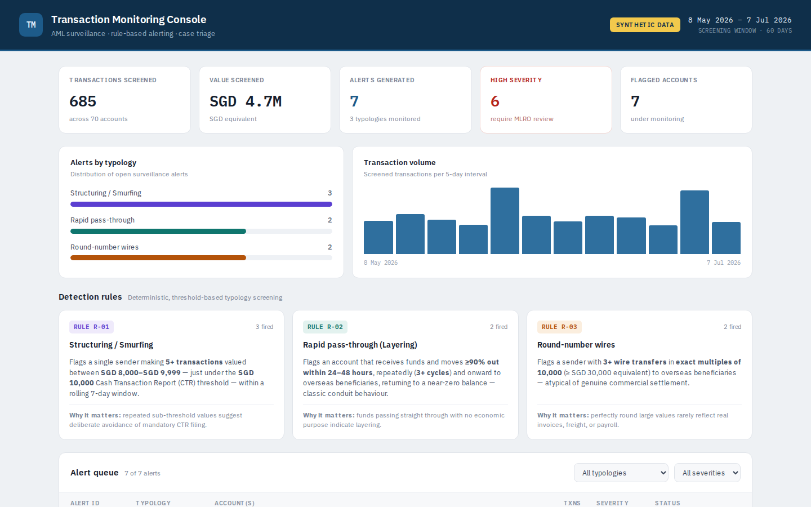

# AML Transaction Monitoring Console

An interactive, browser-based transaction monitoring console for anti-money-laundering surveillance. It screens a synthetic payment ledger against three AML typologies, generates explainable alerts, and drafts Suspicious Transaction Report (STR) narratives for MLRO review.

[Open the live console](https://herui03.github.io/aml-monitoring-console/)

This is the small, rule-based front end. The modelling work on 9.5M real benchmark transactions, where rules are compared with a gradient-boosted model at a fixed analyst budget, is in [aml-transaction-monitoring](https://github.com/herui03/aml-transaction-monitoring).

## Why I built it

During my internships at Bank of China Singapore (KYC/CDD, counterparty risk) and Tencent (treasury reconciliation) I saw that most of the work in financial crime is justifying a decision, not producing a flag. This is a compact version of that workflow: data, rules, alert, analyst rationale, filing draft, with every step visible.

## What it does

| Layer | Responsibility |
|---|---|
| Data | Generates about 685 synthetic transactions across 70 accounts over a 60-day window from a seeded RNG, so results are reproducible |
| Detection | Runs three independent threshold-based typology rules over the ledger |
| Triage | Assigns severity (High / Medium / Low), status (Open / Under Review / Escalated) and a plain-English rationale to every alert |
| Reporting | Produces draft STR narratives with a recommended next action |

The synthetic baseline models ordinary activity (payroll, retail spend, B2B invoice settlement, P2P transfers) with a small number of accounts deliberately seeded to behave suspiciously.

## Detection rules

| Rule | Typology | Trigger logic |
|---|---|---|
| R-01 | Structuring / smurfing | 5 or more SGD transactions valued 8,000 to 9,999 from a single sender within a rolling 7-day window (just below the SGD 10,000 CTR threshold) |
| R-02 | Rapid pass-through (layering) | Account receives funds and remits 90% or more of that specific inflow cross-border within 24 to 48h, across 3 or more repeated cycles, where pass-through is the account's dominant behaviour |
| R-03 | Round-number wires | 3 or more wire transfers in exact multiples of 10,000 (at least SGD 30,000 equivalent) to overseas beneficiaries |

Each rule shows its own threshold and rationale in the UI, so a reviewer can see why an alert fired.

## Design notes

Explainability first. Every alert exposes its trigger logic, a severity rationale and the underlying transactions. In a real compliance function an analyst has to justify a filing decision, so the tool is built to make that justification visible.

False-positive tuning. Rule R-02 initially flagged a legitimate high-volume business whose outflows happened to exceed 90% of an inflow. It was tightened to require the outflow to match the specific inflow amount (90 to 110%) and include a cross-border leg, and to require conduit behaviour to be the account's dominant pattern rather than an incidental one. Rules produce investigative leads, not verdicts, and managing the false-positive rate is part of the job.

Analyst judgment. Each alert carries a note on where a benign explanation is plausible (cash-intensive businesses transacting near the threshold, intercompany arrangements explaining rapid onward movement) and what documentation would resolve it.

## Terminology

CTR: Cash Transaction Report (mandatory reporting threshold). STR: Suspicious Transaction Report. MLRO: Money Laundering Reporting Officer. EDD: Enhanced Due Diligence.

## Running it

`index.html` is fully self-contained: no build step, no dependencies, no network calls. Open it in any browser, or use the GitHub Pages link above.

## Disclaimer

All accounts, names and transactions are randomly generated synthetic data for demonstration. No real customer information is represented, and the thresholds are illustrative rather than institution-specific.

Herui Dou, MSc Business Analytics, NTU. [LinkedIn](https://www.linkedin.com/in/heruidou)
